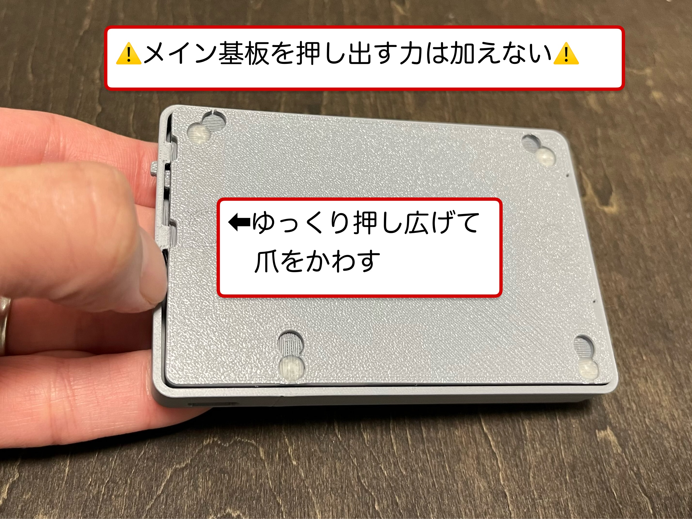
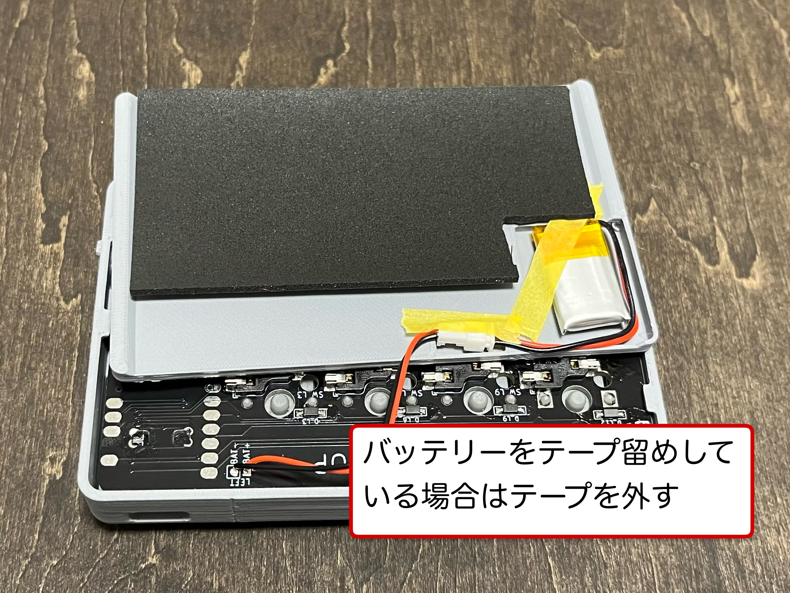
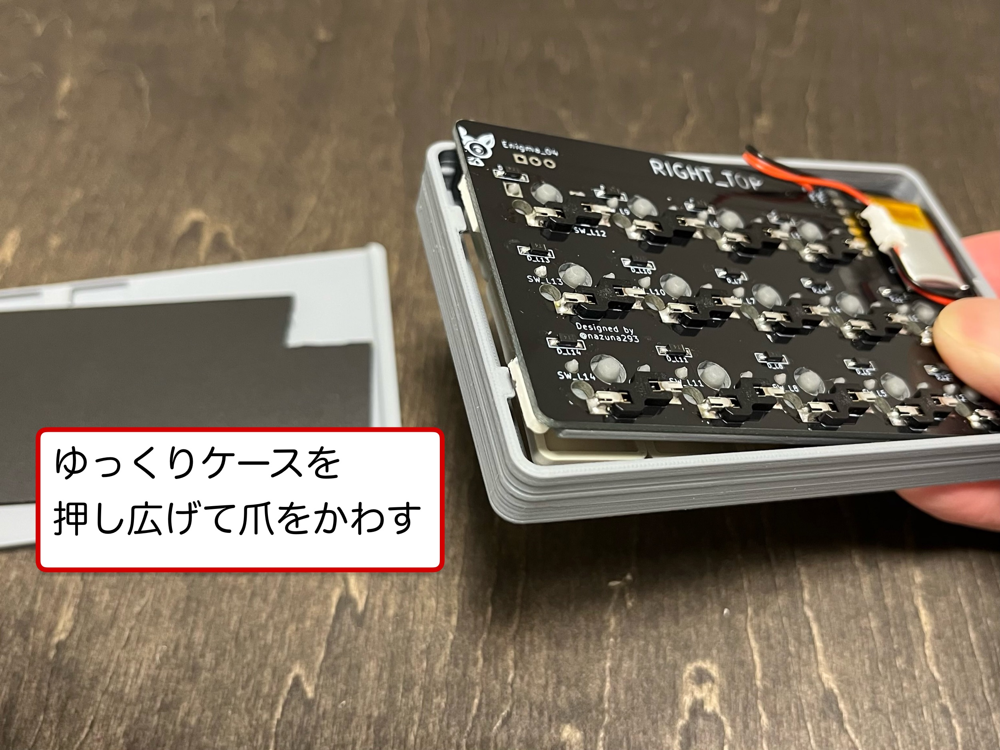
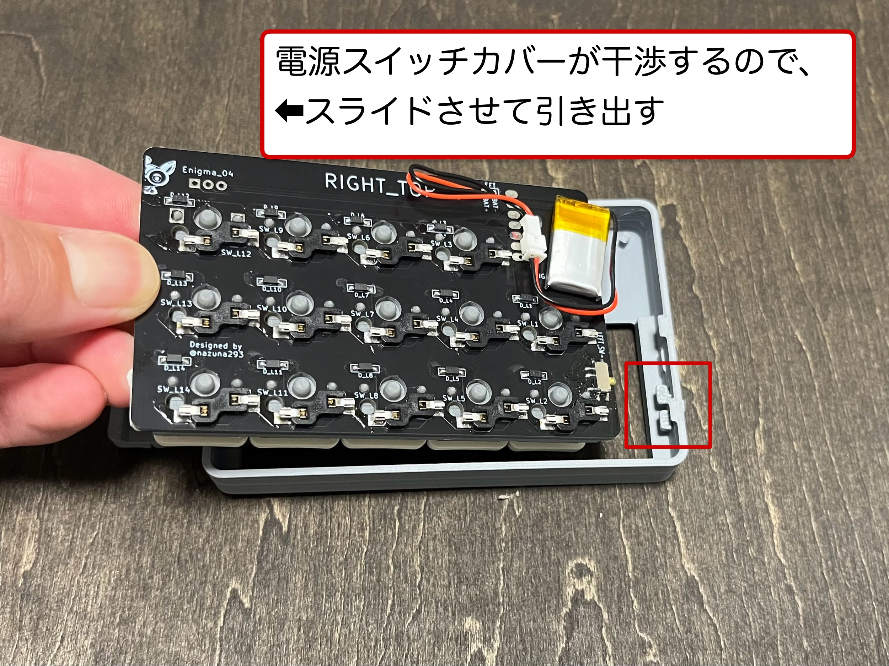
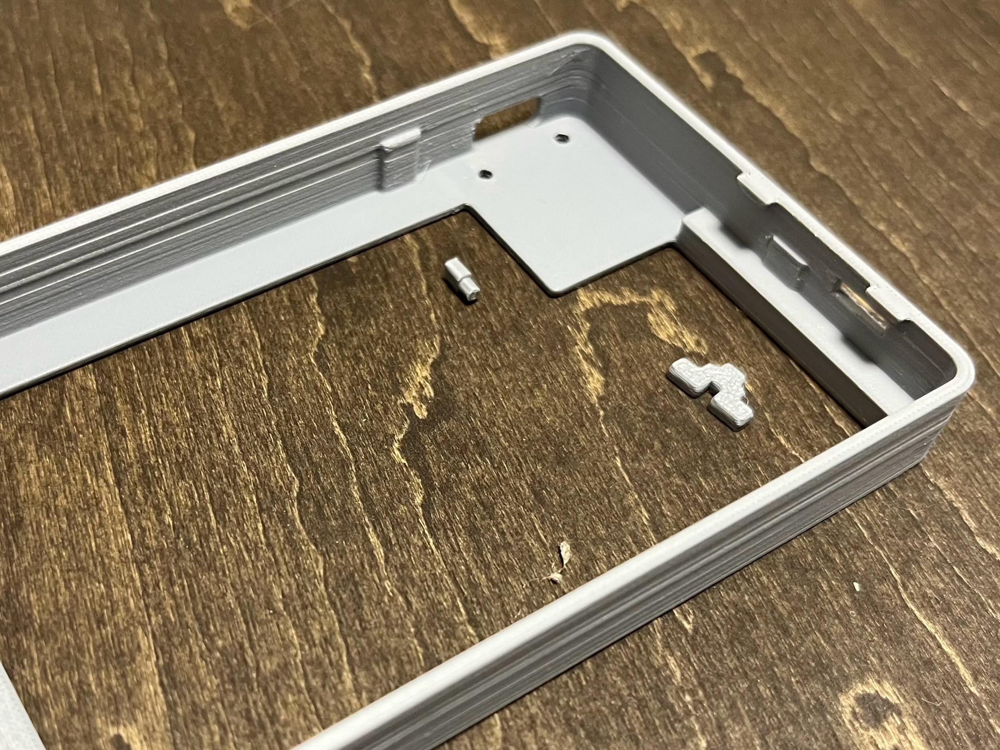

# Enigma_04の構造について
Enigma_04はネジを使用しておらず、**爪の噛み合わせ**で組み立てられています。
[分解手順](#分解手順)と[組立手順](#組立手順)について、以下で説明しています。

> [!CAUTION]
> 電源スイッチカバーと**電源スイッチの噛み合わせに**無理な力がかかると基板から剥がれる恐れがあります。

## 分解手順

### 1 ボトムケースをアッパーケースから外す
電源スイッチと反対側へ寄せて爪の掛かりを浅くして、アッパーケースを押し広げながら爪を外す
> [!CAUTION]
> ケース同士だけに力を加える。メイン基板を裏から押し出すと電源スイッチが破損する恐れがあります。

### 2 バッテリーをテープ留めしている場合は剥がす

### 3 メイン基板をアッパーケースから外す
#### 電源スイッチと反対側の爪から外す
アッパーケースを押し広げながら基板を押し出す
> [!CAUTION]
> 電源スイッチに負担がかからないよう注意

#### 基板をスライドさせて引き出す
基板は真上に引き出さず、爪を外した方へスライドさせて引き出す

### 4 必要に応じてリセットボタンカバーと電源スイッチカバーを取り外す

## 組立手順

### 1 アッパーケースにリセットボタンカバーを取り付ける
> [!Note]
> ピンセットで摘まむと取り付けやすい

### 2 アッパーケースに電源スイッチカバーを取り付ける

### 3 アッパーケースにメイン基板を取り付ける
#### 電源スイッチ側をケースに収める

> [!CAUTION]
> 電源スイッチカバーと電源スイッチの噛み合わせに注意する

#### 反対側をケースに収める
ケースの爪が基板に干渉するのでケースを手で押し広げながら収める

### 4 ボトムケースにバッテリーを収める
組み立てやすいようにテープ留めをおすすめします
ポロンシートはあらかじめテープ留め済み

### 5 アッパーケースにボトムケースをはめる
#### バッテリースペースとは反対側から爪を噛み合わせる
バッテリーやケーブルの収まりを確認しながら閉じていく

#### バッテリースペース側の爪を噛み合わせる
爪がボトムケースに干渉するため、アッパーケースを手で押し広げながら収める
