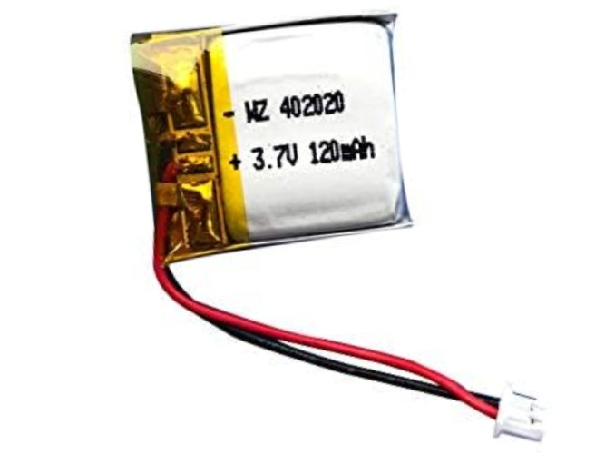

仮
# リポバッテリー取付方法
3.7vリポバッテリーは安全のため保護回路付きで低容量のものをおすすめします。
充電する場合は、**電源オン**の状態でのみUSB給電されます。

## サイズ規格
サイズ:バッテリースペース(W20.5×D25.5×H4.5mm)未満  
コネクタ:2ピン、1.25mmピッチ
バッテリースペースが小さいため、収まりに余裕がないことが想定されます。

おすすめのサイズ規格は**402020**で[Amazon](https://amzn.asia/d/bDyWPns)で1,000円程度で購入できます。

## 取付方法
> [CAUTION!]
> バッテリーの取り外しは**電源オフ**の状態で行ってください。

1. 基板、バッテリーの赤い導線がプラス端子の設計ですが、念のため目視で極性を確認する。間違いなければ、コネクタ同士を接続する。  

2. 電源ボタンを押してマイコンのランプが光れば正しく接続できている。万が一、バッテリーに発熱等の異常があれば、電源を切ってバッテリーを取り外すこと。　　
4. ボトムケースのバッテリースペースへの収まりを確認する。
